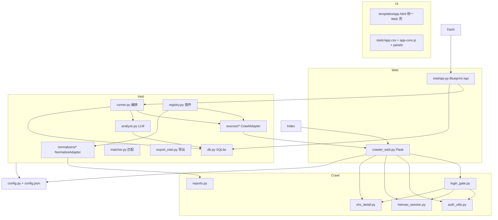

# 舆情爬虫-pkg 代码说明

> **文档版本**：2026-06-11  
> **变更摘要**：console-ux-overhaul 后端：dashboard summary、raw 分页/详情/导出 API、`/dashboard` 重定向 home。  
> **维护规则**：修改代码后须同步更新本文（见 `.cursor/rules/code-guide-sync.mdc`）。

---

## 1. 项目定位与用户故事

### 1.1 产品定位

**舆情爬虫 v9** 是一个 Flask + Patchright（CDP 控制 Chrome）的本地 Web 应用，用于：

1. **手工爬取**：黑猫投诉、小红书关键词搜索 + 详情抓取  
2. **合作方风险情报**：按合作方名单自动监测多源舆情 → AI 打标 → 看板/API 交付  

业务系统对 `source` 自行加权；本系统提供高召回 `relevance`、情感分、风险类型与导出。

### 1.2 用户故事（端到端）

| ID | 角色 | 故事 | 涉及模块 |
|----|------|------|----------|
| US-01 | 运营 | 启动 Chrome，在黑猫/小红书搜索关键词并导出 CSV/JSON | `/?tab=crawl`, `crawler_web.py`, `reports.py` |
| US-02 | 运营 | 未登录时勾选「爬取详情」，系统暂停并等待扫码，登录后自动续跑 | `login_gate.py`, `auth_utils.py`, `heimao_session.py` |
| US-03 | 运营 | 小红书详情通过**搜索页弹窗**抓取，避免 App 墙 | `xhs_detail.py`, `crawl_xhs` |
| US-04 | 风控 | 维护合作方名单（名称、别名、排除词、监测关键词） | `/?tab=partners`, `intel/db.py`, `/api/partners`（写需管理员） |
| US-05 | 风控 | 创建监测任务（合作方 × 数据源 × 页数），手动执行全链路 | `intel/runner.py`, `/api/monitor/*` |
| US-06 | 风控 | 爬取完成后 AI 批分析，查看看板 medium+ 情报 | `intel/analyze.py`, `/?tab=intel`, `/api/intel/records` |
| US-07 | 风控 | 爬取部分失败时，基于已有 raw 数据「重跑 AI」 | `reanalyze_monitor_task`, `/api/monitor/reanalyze` |
| US-08 | 开发 | 对接内网 API 拉取 JSON/Excel 情报 | `intel/export_intel.py`, `docs/API对接说明.md` |
| US-09 | 开发 | 新增第三数据源（仅实现 Adapter + 注册） | `intel/registry.py`, `docs/新增数据源.md` |
| US-10 | 运维 | 观测大模型批次日志与 Token 用量 | `intel/analyze.py`, `/api/analysis/logs`, 看板「AI 分析过程」 |

### 1.3 系统架构（模块关系）



---

## 2. 目录与文件说明

### 2.1 根目录

| 路径 | 类型 | 作用 |
|------|------|------|
| `crawler_web.py` | Python | **主入口**：Flask 应用、全局状态 `S`、Chrome CDP、黑猫/小红书爬取、基础 REST API、挂载 intel 路由 |
| `config.py` | Python | 配置默认值、`load_config`/`save_config`（RLock 防死锁）、路径解析、黑猫详情页 JS 模板 |
| `config.json` | JSON | **持久化配置**（站点、auth、analysis 等）；`api_key` 应留空，用环境变量 |
| `auth_utils.py` | Python | Cookie 解析/注入/导出、微博 SUB / 小红书 session 检测、登录墙判断 |
| `login_gate.py` | Python | 爬取前/中登录门禁、`wait_for_site_login` 轮询续跑、黑猫详情探测 |
| `heimao_session.py` | Python | 黑猫 `sid`、详情 URL 补参、微博 SSO 登录页打开 |
| `xhs_detail.py` | Python | 搜索页点击 note-item 打开弹窗抓详情（禁止 goto explore） |
| `reports.py` | Python | 黑猫/小红书 `structure_*` 结构化、黑猫 HTML/CSV 报表 |
| `requirements.txt` | 文本 | Python 依赖：flask, patchright, openpyxl 等 |
| `代码说明.md` | 文档 | **本文档** |
| `.gitignore` | 配置 | 忽略 `credentials/*.json`、`data/` |
| `start.bat` | 脚本 | Windows 快捷启动（若存在） |

**运行时生成、不入库或忽略：**

| 路径 | 作用 |
|------|------|
| `data/intel.db` | SQLite：合作方、任务、raw/intel、analysis_jobs/logs |
| `credentials/*.json` | 导出的 Cookie；`minimax.env.example` 为 Key 说明 |
| `chrome_heimao_profile/` | 专用 Chrome 用户目录（CDP 9222 登录态） |

### 2.2 `templates/`

| 文件 | 路由 | 作用 |
|------|------|------|
| `templates/app.html` | `/` | 统一入口：监测看板、合作方、监测任务、数据源、采集调试、系统设置、大模型 |
| `static/app.css` | `/static/app.css` | 共用样式 |
| `static/app-core.js` | — | Tab 路由、管理员 Session、全局 status 轮询 |
| `static/panel-*.js` | — | 各 Tab 业务逻辑（intel / crawl / sources） |
| `templates/index.html` | — | 已废弃，redirect 至 `/?tab=crawl` |
| `templates/dashboard.html` | `/dashboard` | redirect 至 `/?tab=home` |
| `admin_auth.py` | — | 管理员 Session、`require_admin` 装饰器 |
| `source_profiles.py` | — | 数据源 CrawlProfile 字段白名单 |

### 2.3 `intel/` 情报层

| 文件 | 作用 |
|------|------|
| `__init__.py` | 包说明 |
| `api.py` | Flask Blueprint `/api`：partners、monitor、intel、analysis |
| `db.py` | SQLite schema v3、CRUD、去重、analysis 日志表 |
| `runner.py` | `run_monitor_task` / `reanalyze_monitor_task` 编排 |
| `analyze.py` | MiniMax/OpenAI-compatible 批分析、情感分、用量日志 |
| `matcher.py` | 合作方别名/排除词匹配、`export_tier` |
| `registry.py` | `SourceRegistry` 注册 heimao/xhs Adapter |
| `export_intel.py` | IntelRecord JSON/CSV/XLSX 导出 |
| `export_raw.py` | raw_records JSON/CSV/XLSX 导出 |
| `sources/heimao.py` | `HeimaoCrawlAdapter` → `crawl_heimao(managed_session=True)` |
| `sources/xhs.py` | `XhsCrawlAdapter` → `crawl_xhs(managed_session=True)` |
| `normalizers/heimao.py` | 黑猫 raw → NormalizedRecord |
| `normalizers/xhs.py` | 小红书 raw → NormalizedRecord |

### 2.4 `docs/`

| 文件 | 作用 |
|------|------|
| `API对接说明.md` | 内网 Intel REST API 说明 |
| `新增数据源.md` | 第三数据源扩展步骤 |
| `如何获取登录凭证.md` | Cookie/扫码登录操作指南 |

Web 路由：`/docs/credentials`、`/docs/intel-api` 静态提供上述 MD。

### 2.5 `openspec/`

OpenSpec **spec-driven** 工作流：正式规格在 `openspec/specs/`，历史变更在 `openspec/changes/archive/`。

| 规格 | 能力 |
|------|------|
| `partner-registry` | 合作方 CRUD |
| `source-adapter` | Crawl/Normalize 插件 |
| `intel-pipeline` | 匹配 + AI + IntelRecord |
| `risk-dashboard-export-api` | 看板 + `/api/intel/*` |
| `heimao-login-gate` / `xhs-login-gate` / `login-wait-resume` / `xhs-detail-modal` | 登录与详情 |

`.cursor/commands/`、`skills/openspec-*` 提供 propose/apply/archive 命令。

**待验证清单**：`openspec/verification-pending.md` 汇总各 archive 未勾选的手动验证项。在本文件勾选完成后执行：

```bash
python scripts/sync_verification_tasks.py push   # 写回 archive .../tasks.md
python scripts/sync_verification_tasks.py status # 查看进度
```

---

## 3. 核心代码说明（按模块）

### 3.1 `crawler_web.py`

#### 全局状态 `S`

| 字段 | 含义 |
|------|------|
| `browser`, `pw`, `ctx` | Playwright CDP 连接 |
| `running`, `running_type` | 是否任务中（`heimao`/`xhs`/`monitor`/`reanalyze`） |
| `phase`, `login_wait` | 登录等待 UI（`/api/status`） |
| `heimao_sid` | 黑猫详情 URL 所需 sid |
| `results_heimao`, `results_xhs` | 手工爬取结果缓存 |
| `logs` | 环形日志（供 `/api/logs`） |

#### Chrome 生命周期

| 函数 | 作用 |
|------|------|
| `ensure_chrome()` | 检测 CDP `/json/version`；未就绪则 `Popen` 启动 Chrome |
| `connect_cdp()` | Playwright `connect_over_cdp` |
| `close_cdp(force=)` | 断开 Playwright；监测长跑中默认不关浏览器 |
| `prepare_browser_for_crawl()` | 优先复用连接 → HTTP 探测 → 启动/强制重置 |

#### 爬取主流程

| 函数 | 作用 |
|------|------|
| `crawl_heimao(kw, pages, fetch_detail, managed_session)` | 搜索黑猫 → 列表 → 可选详情（新标签）；`managed_session=True` 时不改 `S.running` 结束态、不关 CDP |
| `crawl_xhs(...)` | 搜索页按页滚动采集 → 弹窗详情；`max_pages` 为**结果采集页数**（与黑猫一致，每页先滚动再采集） |
| `parse_heimao_link` | 列表页链接解析 |

#### Web 路由（Flask 原生）

| 路由 | 作用 |
|------|------|
| `GET/POST /api/config` | 读写 `config.json`（POST 需管理员；mask api_key） |
| `POST /api/admin/login|logout`, `GET /api/admin/session` | 管理员鉴权 |
| `GET /api/sources?detail=1`, `PATCH /api/sources/{id}`, `PATCH .../profile` | 数据源开关与 CrawlProfile |
| `GET/PATCH /api/monitor/defaults` | 监测默认源/页数/超时（PATCH 需管理员） |
| `GET /api/status` | 运行状态、login_wait、结果计数 |
| `GET /api/logs` | 最近日志 |
| `POST /api/launch` | 启动 Chrome |
| `POST /api/crawl_heimao`, `/api/crawl_xhs` | 手工爬取 |
| `POST /api/stop` | 停止任务 |
| `GET /api/results_*`, `/api/export_*` | 结果与导出 |
| `POST /api/auth/*` | 登录诊断、打开登录页、导出/保存 Cookie |
| `GET /api/report/heimao` | 黑猫 HTML 报表 |

文件末尾 `register_intel_routes(app)` 注册 `/api/*` 情报路由。

---

### 3.2 `config.py` / `config.json`

- **`load_config`**：合并 `DEFAULT_CONFIG` + `config.json`，注入 `*_resolved`、`cdp_url`  
- **`save_config`**：写盘前剥离运行时字段；使用 `RLock` 避免与 `load_config` 嵌套死锁  
- **顶层键**：见 §5 配置索引  

---

### 3.3 `auth_utils.py`

| 函数 | 作用 |
|------|------|
| `load_site_cookies` / `save_site_cookies` | 读写 `credentials/*_cookies.json` |
| `apply_cookies_to_context` | 注入 Playwright；浏览器无 SUB 时跳过过期文件 Cookie |
| `check_login_on_page` | 按 `login_ok_selector`、失败文案、required_cookie_names 判断 |
| `diagnose_login` | 控制台「登录诊断」 |
| `extract_complaint_id` | 黑猫投诉 ID 提取 |

---

### 3.4 `login_gate.py`

| 函数 | 作用 |
|------|------|
| `ensure_login_for_detail` | 爬取前：若需详情且未登录 → 进入等待 |
| `wait_for_site_login` | 轮询直到登录成功或超时；黑猫不反复 goto 打断扫码 |
| `probe_heimao_detail_access` | 打开真实详情页验证可读正文 |
| `xhs_wait_if_search_blocked` | 搜索无 `.note-item` 且未登录 → 等待 |
| `is_*_detail_auth_failure` | 单条详情失败时再等待登录 |

---

### 3.5 `heimao_session.py` / `xhs_detail.py`

- **heimao**：`extract_heimao_sid`、`ensure_heimao_detail_url`、`open_heimao_login_page`（微博 `.com/sso/signin`）  
- **xhs**：`fetch_xhs_detail_via_modal` 点击列表项 → 弹窗内执行 JS 抽字段 → 关闭弹窗  

---

### 3.6 `reports.py`

| 函数 | 作用 |
|------|------|
| `structure_heimao_record` | raw → 中文字段 + `labels` 供 UI 展示 |
| `structure_xhs_record` | 小红书 raw → 统一字段 |
| `build_heimao_report_html` | 独立 HTML 报表 |

---

### 3.7 `intel/db.py`

#### 主要表

| 表 | 作用 |
|----|------|
| `partners` | 合作方 |
| `monitor_tasks` + `monitor_task_partners` | 监测任务（含 `schedule_json`、`last_run_id`） |
| `monitor_task_runs` | 每次执行 Run：时长、分源 token、增量统计 |
| `raw_records` | 爬取原始 JSON（含 `dedup_key`、`content_hash`、`updated_at`） |
| `intel_records` | AI 打标结果（含 `sentiment_*`, `dedup_key`, `is_duplicate`） |
| `analysis_jobs` | 分析作业汇总 + `usage_json` |
| `analysis_job_logs` | 每批次 latency/tokens/状态 |

#### 去重与 UPSERT

- `insert_raw_records`：同 task dedup key 命中时，content 不变 skip；变化则 UPDATE payload/`updated_at`  
- `insert_intel_record`：同 task 相同 `dedup_key` 跳过写入（增量分析在 LLM 前过滤）  
- payload 更新重分析：DELETE 旧 intel 后覆盖 INSERT  

#### 调度

- `intel/scheduler.py`：APScheduler 读 `monitor_tasks.schedule_json.cron` 定时触发同一 task（增量 run）  
- 配置：`monitor.scheduler_enabled`、`monitor.scheduler_timezone`  

---

### 3.8 `intel/runner.py`

```
每次执行 → monitor_task_runs（trigger/analyze_mode/分源 timing+token）

run_monitor_task(trigger, analyze_mode=incremental):
  1. prepare_browser_for_crawl
  2. partner × source 爬取 → insert_raw_records UPSERT
  3. _run_analysis_phase：仅待分析 raw（无 intel 或 raw.updated_at 新于 intel）

reanalyze_monitor_task(analyze_mode):
  incremental — 仅待分析队列
  full_replace — clear_intel_for_task + 全量 LLM
```

---

### 3.9 `intel/analyze.py`

| 环节 | 说明 |
|------|------|
| `_call_llm` | POST OpenAI-compatible；解析 `usage`；Mock 无 Key 且 `mock_without_key=true` |
| `analyze_candidates` | 分批、重试、写 intel、写 `analysis_job_logs`、终端 `[AI]` 日志 |
| 输出字段 | relevance, risk_types, summary, sentiment, sentiment_score |

---

### 3.10 `intel/api.py`（Blueprint `/api`）

| 路由 | 方法 | 作用 |
|------|------|------|
| `/partners` | GET/POST | 列表/创建 |
| `/partners/<id>` | GET/PUT/DELETE | 单条 CRUD |
| `/sources` | GET | 已启用数据源 |
| `/monitor/tasks` | GET/POST | 任务列表/创建 |
| `/monitor/tasks/<id>` | GET/PUT/DELETE | 详情/编辑/删除 |
| `/monitor/run` | POST | 执行全链路 |
| `/monitor/reanalyze` | POST | 仅重跑 AI |
| `/monitor/tasks/<id>/runs` | GET | Run 历史分页（`page`、`limit`，默认 limit=20） |
| `/monitor/runs/<id>` | GET | 单次 Run 详情（timing、token、stats） |
| `/dashboard/summary` | GET | 首页 KPI 聚合 |
| `/intel/records` | GET | 分页筛选情报 |
| `/intel/records/<id>` | GET | 单条情报详情 |
| `/intel/export` | GET | 下载 json/csv/xlsx |
| `/raw/records` | GET | 源数据分页列表（摘要） |
| `/raw/records/<id>` | GET | 源数据详情（含 payload） |
| `/raw/export` | GET | 源数据导出 json/csv/xlsx |
| `/analysis/config` | GET/POST | 大模型配置 |
| `/analysis/jobs` | GET | 作业列表+用量 |
| `/analysis/logs` | GET | 批次日志 |

---

## 4. 数据流（监测任务）

```
合作方名单(partners)
    ↓
创建 monitor_task(partner_ids, sources, max_pages)
    ↓
MonitorRunner: partner × source
    ↓
CrawlAdapter → crawl_heimao/xhs(managed_session=True)
    ↓
raw_records (payload_json)
    ↓
NormalizeAdapter → PartnerMatcher → candidates
    ↓
AnalyzePipeline (批 LLM) → intel_records
    ↓
看板 / GET /api/intel/records / export
```

#### 监测任务 Tab — Run 历史 UI（`static/panel-intel.js`）

- 任务行点击「历史」：行内展开 Run 摘要表，默认 `GET .../runs?page=1&limit=5`
- 「加载更多」递增 page 追加较旧记录；显示 `已加载 x / total`
- 点击摘要行：`UiShell.drawer` 展示完整 stats（含 label + help）、分源 timing/token、错误信息与 `<details>` 字段 glossary
- 支持 `?tab=tasks&run_id=` 深链；首页最近 Run 点击同样打开 Drawer
- 合作方/任务创建编辑使用 Modal；主要交互使用 Toast / Confirm 替代 `alert()`/`confirm()`

---

## 5. `config.json` 配置索引

| 键 | 用途 |
|----|------|
| `server.host/port` | Flask 监听 |
| `chrome.*` | 路径、CDP 9222、profile、启动等待 |
| `paths.output_dir` | 导出目录 |
| `logging.*` | 日志条数上限 |
| `auth.heimao` / `auth.xhs` | 登录 URL、Cookie 文件、require_login、等待超时 |
| `heimao.*` / `xhs.*` | 爬虫选择器、等待、detail 解析；`*.normalize.*` 清洗/归一化开关 |
| `export.*` | CSV/txt 截断 |
| `database.path` | SQLite 路径（含 `prompt_templates` 表） |
| `field_labels.py` | 全站配置字段中文标签 registry |
| `sources.*.enabled` | 插件开关 |
| `admin.*` | 管理员鉴权（`enabled`、`password_env`、`session_secret_env`、`session_ttl_hours`） |
| `monitor.*` | 默认源/页数；`task_timeout_sec` 为监测任务 wall-clock 上限（含爬取+AI） |
| `analysis.*` | LLM endpoint/model/key/batch/重试/Mock；活跃 Prompt 见 SQLite `prompt_templates` |
| `intel.schema_version` | 导出顶层版本，当前 **1.1** |

---

## 6. IntelRecord 字段（schema 1.1）

| 字段 | 说明 |
|------|------|
| `relevance` | high / medium / low / noise |
| `risk_types` | 风险类型数组 |
| `sentiment_label` | positive / neutral / negative |
| `sentiment_score` | -1.0 ~ 1.0 |
| `export_tier` | include / review / exclude |
| `dedup_key` | 源内去重键 |
| `published_at` | 内容发布时间（源页面解析） |
| `captured_at` | **采集时间** = 对应 `raw_records.created_at` |
| `created_at` / `analyzed_at` | **生成时间** = AI 写入 intel 的时刻 |
| `prompt_version`, `model` | 审计（`prompt_version` 为 SQLite 模板 id） |

---

## 7. 启动与依赖

```bash
pip install -r requirements.txt
set MINIMAX_API_KEY=你的Key   # Windows；或在看板填写 api_key
python crawler_web.py
# 舆情情报平台 http://127.0.0.1:5000/
# Tab: intel | partners | tasks | sources | crawl | system | analysis
# 环境变量: ADMIN_PASSWORD（管理员口令）, ADMIN_SESSION_SECRET（Session 签名）
```

---

## 8. 已知限制与待办

| 项 | 说明 |
|----|------|
| 单进程 `S` 全局状态 | 同时仅一个爬取/监测任务 |
| API 无鉴权 | 仅适合内网 |
| OpenSpec 手动验证 | 见 `openspec/verification-pending.md`（26 项，5 个 archive change） |

---

## 9. 文档维护清单

修改下列内容时，**必须**更新本文对应章节：

- [ ] 新增/删除 Python 模块或路由  
- [ ] SQLite 表或 IntelRecord 字段  
- [ ] 监测状态机或登录流程  
- [ ] `config.json` 顶层键  
- [ ] 用户故事 US-xx  

同步更新：`docs/API对接说明.md`（API 变更时）、`openspec/specs/`（规格与实现长期偏离时）。
